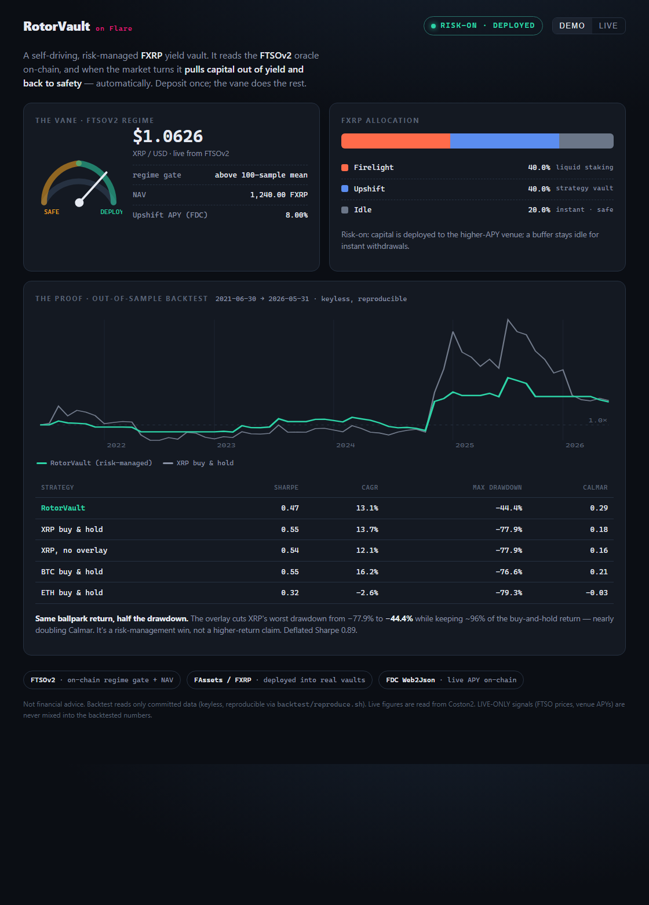

# RotorVault — Dashboard

A self-contained dashboard (single `index.html`, no build step) showing the **product** (live NAV, FXRP
allocation across venues, the FTSOv2 regime vane + XRP/USD price, FDC-attested APY) and the **proof**
(the out-of-sample backtest: RotorVault vs XRP buy-and-hold, with the metrics table).

## View it

- **Locally:** open `web/index.html` in a browser, or serve the repo (`python -m http.server` from the repo
  root) and visit `/web/`.
- **Host it:** drop `web/` on any static host (Vercel, GitHub Pages, Netlify). No backend.

## DEMO vs LIVE

- **DEMO** (default): real committed backtest data + an illustrative live state. Works with no deployment.
- **LIVE**: reads the deployed Coston2 contracts via viem (loaded from a CDN on demand). After the Plan 2
  deploy, paste the six addresses into `web/index.html` → `const LIVE = { addr: { … } }`, then click **LIVE**.
  If addresses are missing or a read fails, it falls back to DEMO with a banner.

## Honesty

The metrics table and equity chart are the **audited backtest results** (keyless, reproducible via
`backtest/reproduce.sh`). Live figures are read from Coston2 and labelled LIVE-ONLY — FTSO prices and
venue APYs are never mixed into the backtested numbers.
